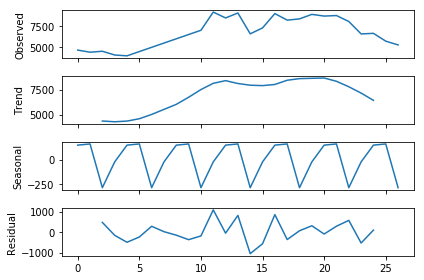
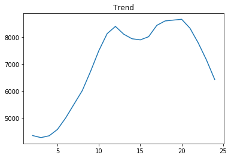
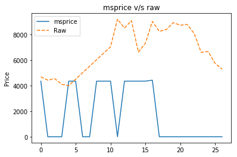
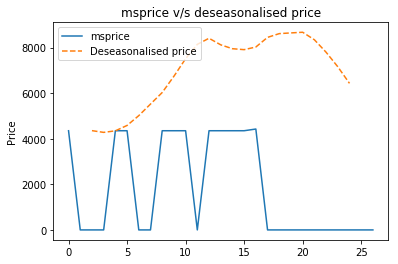

# Submission to Documentation

## Challenge 1: Agriculture Commodities, Prices & Seasons

Aim: Your team is working on building a variety of insight packs to measure key trends in the Agriculture sector in India. You are presented with a data set around Agriculture and your aim is to understand trends in APMC (Agricultural produce market committee)/mandi price & quantity arrival data for different commodities in Maharashtra.

Objective:  
1. Test and filter outliers.
2. Understand price fluctuations accounting the seasonal effect  
    1. Detect seasonality type (multiplicative or additive) for each cluster of APMC and commodities
    2. De-seasonalise prices for each commodity and APMC according to the detected seasonality type
3. Compare prices in APMC/Mandi with MSP(Minimum Support Price)- raw and deseasonalised
4. Flag set of APMC/mandis and commodities with highest price fluctuation across different commodities in each relevant season, and year.

[Data]( https://drive.google.com/drive/u/0/folders/0B-zoMsiXW40gZlNtNnlINEszRTg)

Variable description:  
* msprice- Minimum Support Price
arrivals_in_qtl- Quantity arrival in market (in quintal)
* min_price- Minimum price charged per quintal
* max_price- Maximum price charged per quintal
* modal_price- Mode (Average) price charged per quintal

### Solution:-

#### Cleaning of Data
* In data file “CMO_MSP_Mandi.csv” all words in commodity is made in capital letters as it has same commodities written in both capital letters and small letters.
* In this data file total number of missing values are counted which came in only msprice column with quantity 10 which then removed from the data.
* In data file “Monthly_data_cmo.csv” missing values were counted which came to be 0.
* In this data file those columns are removed which does not have value of modal_price in between min_price and max_price as average price of commodity cannot exceed from its minimum and maximum values.
* Number of such rows was 748.

#### Analysis and Result
Since we have to understand trends in each APMC and Commodity separately and it is not possible to show analysis for each one of them simultaneously, Therefore I have designed my Jupyter Notebook such that user have to type APMC and Commodity for which he wants to see the analysis. Since it take input data from user I am also showing graphs and results of any random APMC and Commodity. If anyone wants to see analysis for any other data, he can refer to my script and input another values for analysis.
* First user have to type APMC for which he wants to see results. I have choosen lets say “Wardha”.
* From data only those rows are taken which has “Wardha” as its APMC.
* From “Wardha” all commodities are shown with its repetition number is written in front of it.
* Now user have to choose commodity for which he wants to do analysis. I have taken “PIGEON PEA (TUR)”.
* Now data of Wardha with commodity PIGEON PEA (TUR) is sorted with respect to year and months with time.
* Value of modal price is taken for this sorted data and price of missing month is replaced by linear interpolation.
* For analysis of seasonality first I assumed series as both multiplicative and additive and extracted seasonal part of data. 
* In seasonal components 4 points with highest maxima are taken and a linear fitted curve is taken from them.
* If series is Multiplicative then in case of additive analysis, amplitude of seasonal component increases as series progresses hance slope of linear fitted curve in additive case would be greater than in case of multiplicative analysis. Hence we can tell that series is Multiplicative and if this is not happening then series is additive.
* Further analysis is done from this prediction of seasonality. In case of  PIGEON PEA (TUR) in Wardha it is coming to be additive series .
* Using this data is divided in Trend ,Seasonal and residual.  
 
 * De-seasonalised data is its Trend part.
 
 * Now msprice of years is compared with original data and Trend\deseasonalised price by plotting them in same plots with time.
 
 
 * Kharif - Months are July-October and Rabi Months are November-March.
 * In Wardha Data points are detected which lie in Kharif season , Rabi season and for whole year. And their variance were calculated for each commodity , and commodity with highest variance is flagged as highest price fluctuation.

    In year  2014 ,commodity with highest price fluctuaton:- PIGEON PEA (TUR)  
    In kharif season of year 2014 commodity with highest price fluctuation:- PIGEON PEA (TUR)  
    In rabi season of year 2014 commodity with highest price fluctuation:- PIGEON PEA (TUR)  

    In year  2015 ,commodity with highest price fluctuaton:- PIGEON PEA (TUR)  
    In kharif season of year 2015 commodity with highest price fluctuation:- PIGEON PEA (TUR)  
    In rabi season of year 2015 commodity with highest price fluctuation:- PIGEON PEA (TUR)  

    In year  2016 ,commodity with highest price fluctuaton:- BLACK GRAM In kharif season of year 2016 commodity with highest price fluctuation:- BLACK GRAM  
    In rabi season of year 2016 commodity with highest price fluctuation:- GRAM

 * Now analysis is done with commodity. Now user have to input commodity and it is detected in different APMC and number of its repetition is calculated in each APMC.  
 I have taken example of cotton.
 * Now its price fluctuation is taken in every APMC in whole year ,Rabi season ,Kharif season. And APMC with highest variance is flagged as highest price fluctuation area.

    In year  2014 ,APMC with highest price fluctuaton:- Jalna  
    In kharif season of year 2014 APMC with highest price fluctuation:- Atpadi  
    In rabi season of year 2014 APMC with highest price fluctuation:- Jalna  

    In year  2015 ,APMC with highest price fluctuaton:- Jafrabad  
    In kharif season of year 2015 APMC with highest price fluctuation:- Atpadi  
    In rabi season of year 2015 APMC with highest price fluctuation:- Maregaon  

    In year  2016 ,APMC with highest price fluctuaton:- Jafrabad  
    In kharif season of year 2016 APMC with highest price fluctuation:- Yawal  
    In rabi season of year 2016 APMC with highest price fluctuation:- Bhokar